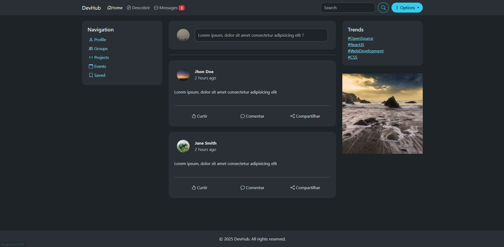
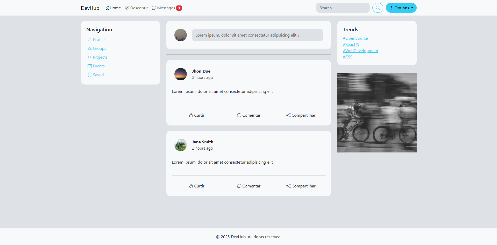
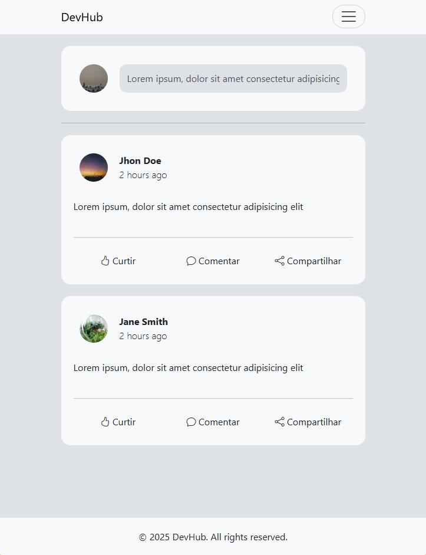

# DevHub -- Interface de Feed

Projeto desenvolvido para praticar **Bootstrap 5**, **Sass** e
organização de layout responsivo.





## 📌 Objetivo do Projeto

Este exercício teve como foco:

-   Aprender a **estruturação de layouts** utilizando **Bootstrap
    Grid**.
-   Praticar **componentização** e **estilização personalizada** com
    **Sass**.
-   Criar uma interface moderna inspirada em redes sociais.
-   Trabalhar com **ícones do Bootstrap Icons**.
-   Entender como separar estilos em **arquitetura Sass** e compilar
    para CSS final.

## 🛠️ Tecnologias Utilizadas

### **Bootstrap 5**

Usado para: - Grid responsivo
- Cards
- Botões e ícones
- Componentes utilitários

### **Sass (SCSS)**

Usado para: - Variáveis de cores e espaçamentos
- Organização modular (`_variables.scss`, `_bootstrap.scss`, etc.)
- Estilos customizados acima do Bootstrap
- Melhor manutenção e reaproveitamento de código


## 🖼️ Sobre a Interface Criada

A página simula uma home de feed social com:

-   Navegação lateral
-   Campo de postagem
-   Cards de posts
-   Ações (Curtir, Comentar, Compartilhar)
-   Trends/hashtags
-   Imagem lateral ilustrativa


## 📚 Aprendizados Obtidos

✔ Bootstrap Grid
✔ Sobrescrita de estilos com Sass
✔ Modularização SCSS
✔ Geração de CSS compilado
✔ Consistência visual em UI


## 🚀 Como executar
Siga os passos abaixo para rodar o projeto em modo de desenvolvimento:

1. Instale as dependências:

```powershell
npm install
```

2. Inicie o servidor de desenvolvimento (Vite):

```powershell
npm run dev
```

3. (Opcional) Gerar build de produção:

```powershell
npm run build
npm run preview
```

## 🗂️ Estrutura do Projeto

Visão geral dos principais arquivos e pastas do repositório:

```
. 
├── index.html
├── package.json
├── README.md
├── tsconfig.json
├── public/
│   ├── layout-dark.png
│   ├── layout-light.png
│   └── mobile-version.png
└── src/
    ├── main.ts
    └── scss/
        ├── _bootstrap.scss
        ├── _variables.scss
        └── style.scss
```
